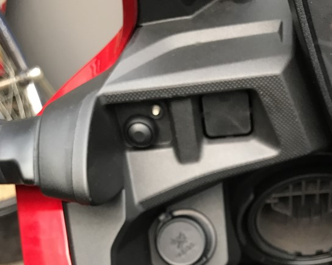
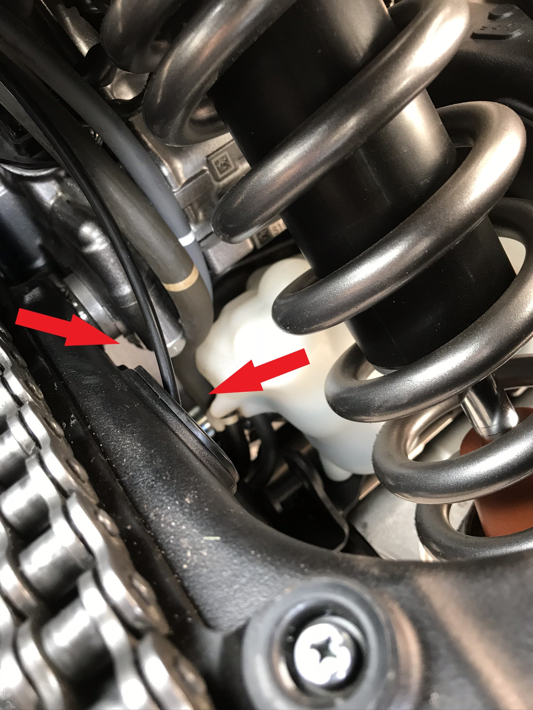
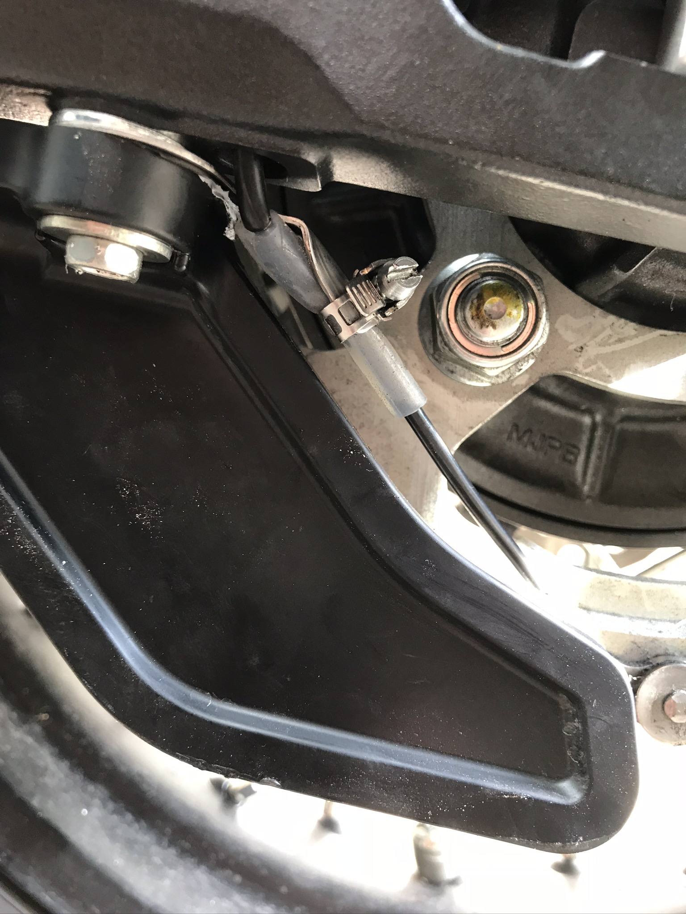

#### Einbaubeispiel 

# Africa Twin SD06 DCT

Vorne im Cockpit fand sich schnell ein Plätzchen für den Button und die LED (sorry, etwas unscharf):

Für die Montage musste allerdings das halbe Fahrzeug auseinandergebaut werden. Anleitungen gibt's aus der Juhutube.

Öltank und Pumpe befinden sich unter dem Fahrersitz, der Öler unterm Sozius. Stromabnahme hinten links (direkt ans Kabel gelötet - es soll aber auch Stecker geben...).

Der Auslassschlauch wurde durch die Schwinge gezogen (hier ein Foto vom vorderen Eingang):

Hinten dann passend hinter dem seitlichen Kettenschutz der Auslass aus der Schwinge. Die Auslassdüse wurde dort mit einer Trägerplatte unten an die Schwinge geschraubt und dann so ausgerichtet, dass sie kurz über der Kette ziemlich dicht am Kettenrad endet (nicht so gut zu sehen). Eine kleine Schlauchschelle hält den Schlauch und die Düse (hier noch mit einem Stück größerem Schlauch umgeben) an der Trägerplatte:

