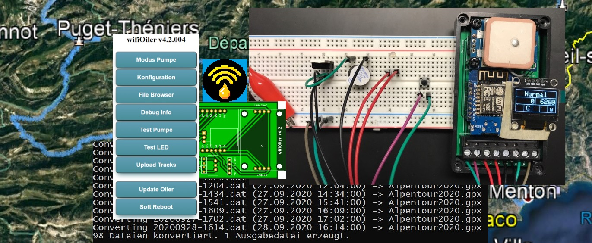

# wifiOiler

Automatischer streckenabhängiger Kettenöler für's Motorrad mit folgenden Funktionen:

- Ermittlung der zurückgelegten Strecke per GPS.
- Auslösen eines Ölvorgangs nach einer einstellbaren Anzahl von Metern.
- Drei verschiedene Distanzen oder Modi einstellbar (Normal, Regen, Offroad). 
- Notlaufprogramm = zeitabhängiges Ölen, falls kein GPS Signal empfangen werden kann.
- Bedienung über Button, Feedback per zweifarbiger LED.
- Erweiterte Bedienung über jedes internetfähige Gerät, auf dem ein Internet Browser läuft, z.B. Handy, Notebook, etc..
- Der Öler kann sich in ein bestehendes WLAN einklinken oder selber einen Access Point erstellen.
- WiFi kann jederzeit an- oder ausgestellt werden (während der Fahrt wird WiFi automatisch abgeschaltet).
- Aufzeichnung der gefahrenen Strecken im Speicher (LittleFS-Dateisystem) des verwendeten ESP8266 Chips (Platz für ca. 45 Stunden Fahrzeit vorhanden).
- Übertragen (und löschen) der aufgezeichneten Strecken per WLAN auf einen zentralen Web-Server (s. Oilerbase auf Basis eines Raspberry Pis, Strecken können auch manuell heruntergeladen werden).
- Herunterladen von Updates von einem zentralen Web-Server (s. Oilerbase). Updates können auch per Upload ausgelöst werden.
- PHP Skripte und html Dateien für den zentralen Web-Server (Apache auf Raspberry Pi, s. Oilerbase)
- Software zur Konvertierung der aufgezeichneten Tracks in das .gpx Format (können dann z.B. auf Google Earth angezeigt werden).

In diesem Repo zu finden:

- Schaltplan und Teileliste zur Erstellung und Bestückung der Platine.
- Vorschläge für Bauteile zum Einbau in das Motorrad.
- Komplette Software für Öler, Oilerbase und Track Konvertierung.
- Anleitungen für Aufbau, Inbetriebnahme und Bedienung (s. "docs").
- Einbauvorschlag.

## Credits

Detlev Axon, creator of [RehOiler](https://www.rehtronik.de/startseite1.html)

Mikal Hart, creator of [TinyGPS++](https://github.com/mikalhart/TinyGPSPlus), an NMEA parsing library.

Hristo Gochkov for the FSBrowser example.

Maarten Lamers for his distance calculation (taken from TinyGPS++)

Patrick Gillespie for his [Macro Font Generator](http://patorjk.com/software/taag).

And many thanks to all the others who share their knowledge
