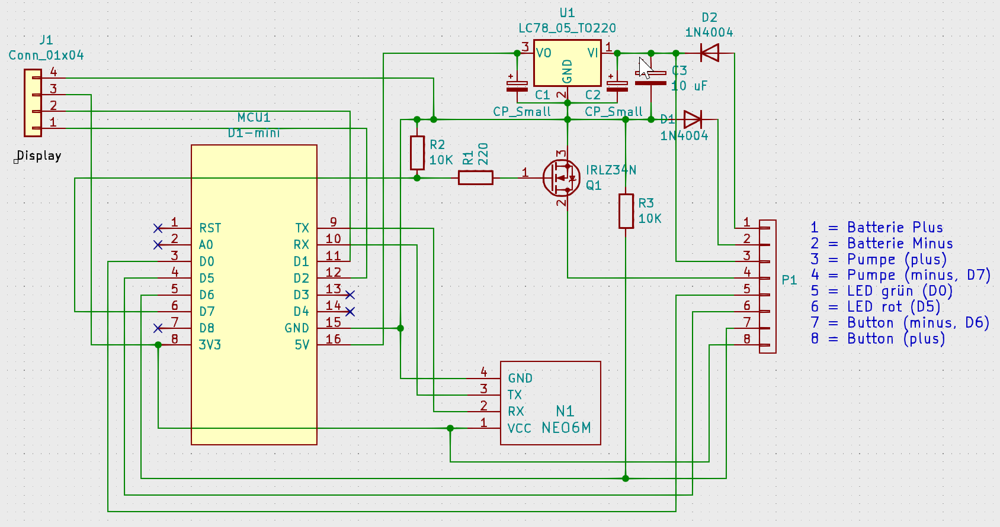
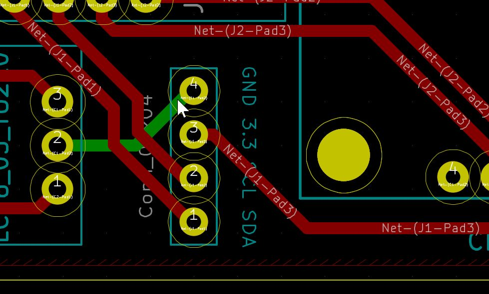
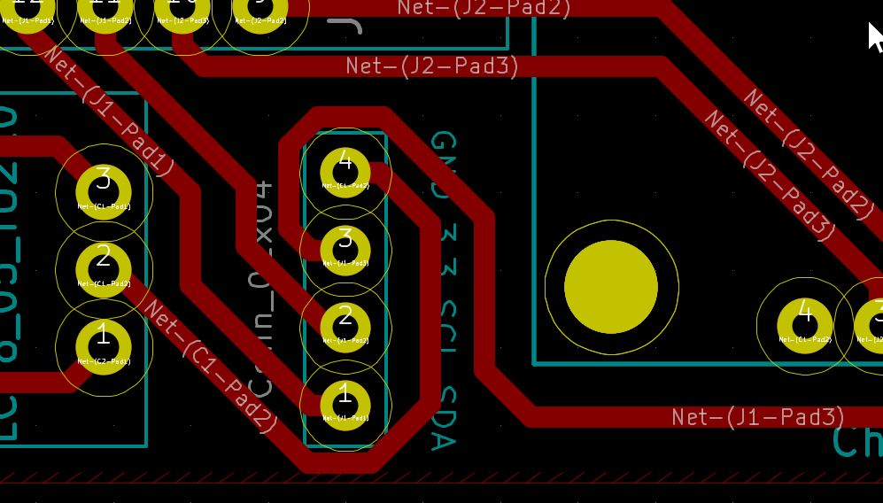

# Schaltung

Die Schaltung wurde zuletzt mit KiCad 5.1.9_1 bearbeitet. Alle Symbole und Footprints wurden lokal verlinkt und sind in den Verzeichnissen enthalten (Symbole in wifiOilerLib.lib, Footprints in ProjectFootprints.pretty).

Abstände und Leiterbahnen wurden großzügig ausgelegt, um Fräsen und Löten zu erleichtern.

Noch ist eine Leiterbahn auf der zweiten Seite vorhanden, die aber auch noch eliminiert werden kann, wenn die Leiterbahnen, die zum Displayanschluss führen, etwas umgeroutet werden. Für eine Auftragsfertigung ist es fast egal, ob ein- oder zweiseitig, da viele Fertiger einseitige Platinen gar nicht mehr anbieten.

