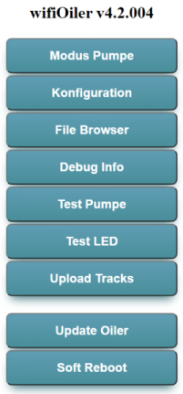
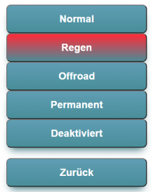

# Bedienung des Ölers
Der Öler kann über eine Web-Oberfläche bedient werden. Dafür wurde auf dem ESP8266 Chip ein kleiner Web-Server implementiert. Ich habe bisher noch nicht erlebt, dass bei bestehender Verbindung eine Seite mal nicht geliefert wurde - man sollte aber auf jeden Fall Geduld mitbringen, da es manchmal bis zu 10 Sekunden dauern kann - also nicht nervös werden und Reaktion des Browsers abwarten. Tippt man hektisch auf den Buttons herum, bringt das den kleinen Rechenknecht nur in Schwierigkeiten...
## WLAN Aktivierung
Nachdem der Öler gestartet wurde, kann er über eine Web-Oberfläche bedient werden. Ist der Öler so konfiguriert (s. Einstellungen), dass das WLAN automatisch aktiviert wird, ist sonst nach dem Start keine Aktion erforderlich. Muss dagegen das WLAN manuell aktiviert werden, wird der Button so lange gedrückt, bis die LED rot leuchtet (dies ist das Zeichen dafür, dass ein langer Tastendruck erkannt wurde).
 Bei Aktivierung des WLANs versucht der Öler, sich mit einem der in der Datei "wifi.ini" konfigurierten WLAN Netze zu verbinden. Ist dies nicht möglich, wird ein eigener Access Point aktiviert, an dem man sich anmelden kann. Name und Passwort des Access Points wird in den Einstellungen konfiguriert (s. Konfiguration).  Ist ein Display angeschlossen, zeigt die WLAN Statusanzeige nun ein 'w' für ein verbundenes WLAN oder ein 'A' für einen erstellten Access Point. Ohne Display wird das Ergebnis durch ein LED Feedback angezeigt (mehrmaliges grünes Flackern für WLAN, erst rotes dann grünes Flackern für einen Access Point).
 Bei Auslieferung heißt der Access Point "wifiOiler" und das Passwort "alteoile". Dies sollte in den Einstellungen bald geändert werden, damit nicht jemand anderes am Öler Einstellungen ändern kann.
## Hauptmenü der Web-Oberfläche
Im oberen Teil wird der Name des Ölers (ist identisch mit dem Namen des Access Points) und die Version angezeigt. Danach sind mehrere Buttons zu sehen:
 
### Modus Pumpe
Ein Untermenü mit den einstellbaren Modi erscheint. Die aktuelle Einstellung wird durch einen roten Button angezeigt. Wählen kann man
 
 Nach welchen Entfernungen bei den einzelnen Modi geölt wird, kann in den Einstellungen konfiguriert werden. Üblicherweise wird bei **Regen** deutlich öfter geölt, als bei trockener Straße (also **Normal**), da die Nässe das Öl von der Kette wäscht. Bewährt hat sich bei mir die zweifache Menge. Wenn im Normalzustand also alle 6000 Meter geölt wird, ist bei Regen ein Wert von 3000 Meter ein guter Richtwert.
 Bei **Offroad** Fahrten sollte noch öfter geölt werden, damit an der Kette haftender Dreck nicht wie Schmirgelpapier wirkt.
 Der Modus **Permanent** kann verwendet werden, wenn das System enlüftet werden soll (z.B. nach dem Einbau). Eine manuelle Entlüftung sollte allerdings zuerst vorgenommen werden, damit die Pumpe nicht stundenlang im Dauerbetrieb ist.
 Den Modus **Deaktiviert** verwende ich eigentlich nur zum Testen oder Debuggen.
 Da man während der Fahrt nicht das Handy aus der Tasche ziehen kann (bzw. sollte!), wird der Pumpenmodus dann über den eingebauten Button umgestellt. Dabei wird jeweils pro Knopfdruck ein Modus weitergeschaltet, von **Normal** zu **Regen**, dann zu **Offroad**, dann **Permanent**, dann aus und danach wieder zu **Normal**. 
 Nach jedem Knopfdruck wird die gewählte Pumpeneinstellung durch ein LED Signal angezeigt
* 1 x grün = **Normal**
* 2 x grün = **Regen**
* 3 x grün = **Offroad**
* 4 x grün = **permanent**
* 1 x rot = **aus**
 Genau 1,5 Sekunden nach dem letzten Knopfdruck wird die gewählte Einstellung aktiv. Durch diese Verzögerung können die Modi durchgeschaltet werden, ohne dass gleich die Pumpe ausgelöst wird.
### Konfiguration
In diesem Dialog lassen sich die Einstellungen des Ölers dauerhaft ändern. Die einzelnen Einstellungen sind nochmal separat [hier](Einstellungen.md) beschrieben.
### File Browser
Ein File Browser für die Dateien im Dateisystem des ESP8266, welches für Konfígurationsdateien, HTML-Sourcen für den Web-Server und für die aufgezeichneten Touren (Track files) verwendet wird. Es sind auch Editierfunktionen vorhanden, um z.B. die WiFi-Konfiguration zu ändern, Track Files zu löschen, etc. Trotz Sicherheitsabfrage sollte man hier sehr vorsichtig sein. Löscht man versehentlich die Konfiguration oder HTML Dateien, muss das Dateisystem ggf. wieder extern 'beladen' werden (wozu der Öler ggf. ausgebaut werden muss - also Vorsicht!).
 Es stehen drei Varianten für den File Browser zur Verfügung (kann in den Einstellungen geändert werden). Der Standard Browser (/littlefsb.htm) verbraucht am wenigsten Platz und kann ohne Verbindung zum Internet genutzt werden. Weitere Infos s. [Einstellungen - FSBrowser & Editor](Einstellungen.md/#fsbrowser)
### Debug Info
Hier werden Laufzeit Informationen, die aktuelle Konfiguration und der Inhalt des Dateisystems angezeigt. Außerdem wird hier die restliche Speicherkapazität angezeigt und die (mit der aktuellen Konfiguration) verbleibende Aufzeichnungszeit.
### Test Pumpe
Hiermit kann man testen, ob der Öler richtig aufgebaut und angeschlossen wurde. Die Pumpe wird so oft ausgelöst, wie in der Konfiguration vorgegeben (Anzahl Pumpaktionen pro Ölvorgang).
### Test LED
Die LED blinkt dreimal grün und dreimal rot. So kann festgestellt werden, ob die zweifarbige LED richtig angeschlossen wurde.
### Upload Tracks
Ist ein Upload Server vorhanden, können die aufgezeichneten Tracks hochgeladen werden. Nach erfolgreichem Upload werden sie im Öler Dateisystem gelöscht, um den Speicherplatz wieder freizugeben. Siehe Dokumentation zur [Oilerbase](Oilerbase.md).
### Update Oiler
Ist die Oilerbase implementiert, kann von dieser ein Update geladen und installiert werden (es gibt allerdings auch andere Wege). Siehe Dokumentation zur [Oilerbase](Oilerbase.md).
### Soft Reboot
Mit dieser Funktion kann der Öler neu gestartet werden. Normalerweise überflüssig, kann man aber mal verwenden, wenn man die Einstellungen per Editor geändert hat und diese aktiv werden sollen.