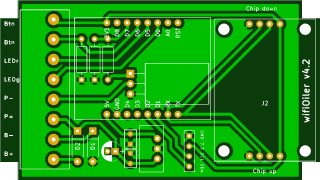

# Bauteilliste
Die meisten hier gelisteten Teile habe ich bei reichelt.de bezogen und verlinke sie auch entsprechend als Beispiel. Das tue ich, damit es keine Unstimmigkeiten bei der Beschaffung der Teile gibt. Dies soll keine Werbung für einen bestimmten Versender sein und ich bekomme auch keine Vergünstigungen dafür.
 

* 1 x Wemos (Lolin) D1 mini V2, die genaue Bezeichnung ist wohl "ESP8266 D1 Mini ESP-12F" [(Beispiel)](https://www.reichelt.de/d1-mini-esp8266-v3-0-d1-mini-p253978.html) 
* 1 x Spannungswandler auf 5V [(Beispiel)](https://www.reichelt.de/dc-dc-wandler-2-5-w-5-v-500-ma-to-220-lc78-05-0-5-p242823.html)
* 2 x Folienkondensator für Spannungswandler [(Beispiel)](https://www.reichelt.de/folienkondensator-100nf-63v-rm2-5-mks02-63-100n-p12314.html)
* 1 x Elko [(Beispiel)](https://www.reichelt.de/elko-radial-10-f-63-v-rm-2-0-85-c-2000h-20--rad-10-63-p15099.html)
* 1 x Mosfet IRLZ34N [(Beispiel)](https://www.reichelt.de/mosfet-n-ch-55v-30a-68w-to-220ab-irlz-34n-p41777.html)
* 1 x Widerstand 220 Ohm [(Beispiel)](https://www.reichelt.de/widerstand-metallschicht-220-ohm-0207-0-6-w-1--metall-220-p11627.html)
* 2 x Widerstand 10 KOhm [(Beispiel)](https://www.reichelt.de/widerstand-metallschicht-10-0-kohm-0207-0-6-w-1--metall-10-0k-p11449.html)
* 2 x Gleichrichterdiode (Verpolungsschutz) [(Beispiel)](https://www.reichelt.de/gleichrichterdiode-400-v-1-a-do-41-1n-4004-p1726.html)
* 2 x Stiftleiste (8) [(Beispiel)](https://www.reichelt.de/buchsenleiste-8-pol-gerade-rm-2-54-h-7-0-mm-bl-1x08g7-2-54-p180553.html)
* 2 x Stiftleiste (4) (oder: die 8er Leiste 3 x nehmen und eine in der Mitte durchtrennen)
* 1 x Stiftleiste (8) für Anschlüsse am Öler [(Beispiel)](https://www.reichelt.de/stiftleiste-fuer-anschlussklemme-8-polig-rm5mm-stl-017-08-p72099.html)
* 1 x Anschlussklemme für Anschlüsse am Öler [(Beispiel)](https://www.reichelt.de/steckbare-anschlussklemme-8-polig-rm5mm-akl-007-08-p72092.html)
* 1 x GPS Modul (siehe z.B. ebay) [(Beispiel)](https://www.ebay.de/itm/172363912859)
* 4 x Abstandsbolzen M3/6mm, für GPS Modul Montage auf Platine ([Beispiel](https://smile.amazon.de/Schrauben-Schraubenmutter-Sechskant-Distanzh%C3%BClsen-Aufbewahrungsbox/dp/B07KTZW5VL/ref=sr_1_23))
* 1 x Universalgehäuse 85 x 50 x 29 [(Beispiel)](https://www.conrad.de/de/p/tru-components-tc-2028-sw203-1588521-modul-gehaeuse-85-x-50-x-29-abs-schwarz-1-st-1588521.html)
* Optional: 0.96 Inch OLED I2C Display [(Beispiel)](https://www.az-delivery.de/en/products/0-96zolldisplay)
* Ölpumpe, z.B. Dellorto Ölpumpe 12308 ([Beispiel](https://www.ebay.de/itm/Dellorto-Olpumpe-12308-/283344637971))
* 2 x Flachsteckerhülse für Anschluss der Pumpe ([Beispiel](https://www.reichelt.de/flachsteckerhuelse-breite-2-8mm-blau-fsh-b-2-8-p7907.html))
* 1 x Zweifarbige LED für Cockpit ([Beispiel](https://www.reichelt.de/duo-led-3-mm-bedrahtet-2-pin-rt-gn-14-mcd-60--led-3-rg-p10229.html))
* 1 x Einbaufassung für LED ([Beispiel](https://www.reichelt.de/einbaufassung-fuer-3-mm-leds-innenreflektor-schwarz-ebf-i-3-s-p7293.html))
* 1 x Button/Drucktaster  ([Beispiel](https://www.reichelt.de/drucktaster-ip67-sw-is-r3s-sw-p105682.html))
* Kabel zum Anschluss von LED und Button im Cockpit, sollte abgeschirmt sein ([Beispiel](https://www.reichelt.de/fernmeldeleitung-2-x-2-x-0-6-mm-5-m-ysty-2x2-5-p22965.html))
* Öltank aus dem Modellbau, Größe je nach verfügbarem Platz ([Beispiel](https://www.conrad.de/de/p/du-bro-404-kunstflugtank-120-ml-2190015.html)).
* KFZ-Flachsicherung ([Beispiel](https://www.reichelt.de/kfz-sicherung-normoto-3-a-violett-imaxx-f1503-p242048.html))
* KFZ Sicherungshalter ([Beispiel](https://www.reichelt.de/kfz-sicherungshalter-normoto-20-a-32-v-ip56-imaxx-h1325-p229033.html))
* Öl Auslassdüse am Kettenrad (hier am besten mal Ersatzteile bei kommerziellen Ölern checken). Es reicht auch ein dünnes, stabiles (ggf. schräg angeschnittenes Plastikröhrchen, sollte unten am Kettenrad enden, kurz über der Kette, damit die Schwungkraft das Öl zur Kette transportiert). Ist der Auslass, also der Durchmesser dieses Röhrchens zu groß, läuft u.U. der ölschlauch leer, gerade wenn es im Sommer etwas heißer und das Öl "dünner" wird.
* Schläuche für Verbindung Tank - Pumpe und Pumpe - Auslass und vielleicht Schellen oder Klemmringe zur Befestigung der Schläuche. Die Dellorto Pumpe hat einen Eingang (Verbindung vom Tank kommend) mit 6,8 mm Außendurchmesser und einen Ausgang mit 3,5 mm Außendurchmesser. Der Schlauch von der Pumpe zur Auslassdüse am Kettenrad sollte schon etwas steifer sein (Hydraulikschlauch), da schlabbrige Schläuche in Ecken gelangen können, wo sie nichts zu suchen haben ;-).
* Befestigungsmaterial für Schläuche und Kabel zur Verlegung am/im Motorrad.
* Ggf. noch ein Ventil für den Entlüftungsschlauch am Tank. Durch heftige Schüttelbewegungen im Gelände kann eventuell durch den Entlüftungsschlauch Öl entweichen ([Beispiel](https://www.amazon.de/dp/B07CMRJ314/ref=pe_3044161_189395811_TE_SCE_3p_dp_1)).
#### Anmerkungen
* Die oben erwähnten Abstandsbolzen für die GPS-Modul Montage sind leider nicht wirtschaftlich zu beschaffen. Eigentlich kann man diese nur in Sortimentsboxen finden, die sich auch noch irgendwie viel zu teuer anfühlen (8-10,- Euro für eine Handvoll Plastik) und sehr wahrscheinlich nur teilweise gebraucht werden. Manchmal kann man solche Bolzen beim Auseinandernehmen von Elektroschrott finden. In der Größe M3 sind sie zwar etwas wuchtig, aber auch sehr stabil. M2 ist für die größeren Öffnungen im GPS-Modul schon fast zu klein. Kunststoff oder Messing ist Geschmacksache, man sollte aber daran denken, dass Messing leitfähig ist (noch besser als Zinn). Sehr passend sind hier M3 Varianten aus Kunststoff.
* Bei der Wahl der Kondensatoren und der entsprechenden Schaltung rund um den Spannungswandler gibt es vielleicht Optimierungsbedarf. Ich habe damit zu wenig Ahnung/Erfahrung und habe mir Teile der Schaltung im Internet zusammengesucht. Eins ist aber sicher: die Schaltung verrichtet bei mir seit drei Jahren einwandfreie Dienste. Vorschläge zur Optimierung nehme ich aber gerne entgegen. Anfangs habe ich übrigens lineare Spannungswandler (wie den LF50CV) verwendet - die wurden mir aber zu heiß.
* die 8er Stiftleiste durchzutrennen, um zwei 4er Leisten zu bekommen kann schon mal in die Hose gehen. Glatt in der Mitte zu brechen ist schon eine Herausforderung, besser ist schneiden, wobei das Material schon recht hart ist. Wenn man es wirklich sauber haben will, bestellt man sich 4er Leisten. Ich persönlich bestelle immer 16er und schneide sie zurecht.
* Als GPS Modul verwende ich die älteren aber sehr bewährten Neo-6M Module von u-blox. Die 8er Reihe habe ich auch schon getestet (in der Grundkonfiguration) und bin damit auch sehr zufrieden. Sicherlich kann man noch mehr aus den neueren Modulen herausholen. Für eine genauere Analyse fehlte mir aber bis jetzt die Zeit. Für die Auswahl ist aber wichtig, was auf dem verbauten u-blox Chip steht und nicht in der Artikelbeschreibung. Schon mehrfach habe ich gehört, dass das billigste Suchergebnis bei z.B. ebay nicht unbedingt das war, was es versprach...
* Das Display ist mehr eine Spielerei. Eigentlich würde ich das gerne mit Button und LED am Lenker verbauen, habe aber bis jetzt kein passendes Gehäuse kaufen/herstellen können. Während der Bauphase liefert es aber nützliche Informationen, wie z.B. den eingestellten Pumpenmodus und ob GPS empfangen wird.
# Platine
Um eine passende Platine zu erstellen, gibt es verschiedene Möglichkeiten. Folgende habe ich ausprobiert:
### Tonerdirekttransfer
Man benötigt eine Platine, die einseitig mit Kupfer beschichtet ist und einen Laserdrucker. Mit dem Laserdrucker wird die Schaltung auf nicht zu saugfähiges Papier gedruckt (spiegelverkehrt). Der Ausdruck wird nun auf die Platine gelegt, sorgfältig fixiert, mit einer Aceton/Alkohol Lösung getränkt und fest auf das Kupfer der Platine gepresst (am besten mit einer Andruckrolle). Ist das Aceton und der Alkohol verflogen, entfernt man das Papier und siehe da: die Schaltung in Form des Toners befindet sich nun auf der Kupferschicht der Platine. Fehlerhafte Stellen können nun mit einem permanenten Edding Stift ausgebessert werden. Danach wird das überflüssige Kupfer mit Säure abgewaschen (entweder im Säurebad oder mit einem kleinen Schwamm). Zum Schluss müssen noch die Bohrlöcher gesetzt werden (Bohrständer setze ich mal voraus - so aus der Hand ist das nahezu unmöglich). Mit ein wenig Übung lassen sich so in Heimarbeit in kurzer Zeit nutzbare Platinen herstellen.
 Hinweis: zu den einzelnen Arbeitsschritten gibt es im Internet unzählige Informationen.

### Portalfräse
Mit einer einfachen (Portal-)Fräse lassen sich natürlich auch Platinen herstellen - die Isolationsbahnen werden einfach ausgefräst. Und das Bohren muss hier nicht manuell durchgeführt werden, auch das wird mit der richtigen Software erledigt. Bis der Workflow ausgetüftelt ist und die Einstellungen richtig gesetzt sind, dauert es sicher ein wenig (wenn man den Verlust einiger Platinen und Stichel/Bohrer verkraften kann). Aber auch dann kann innerhalb kurzer Zeit ohne Fremdhilfe eine Platine erstellt werden.
### Auftragsfertigung
Zum Schluss habe ich mal einen chinesischen Fertiger ausprobiert, der mit einem unglaublichen Angebot lockte (5 Platinen für 2$). Auf der entsprechenden Web-Seite lädt man den Schaltplan (bzw. die sogenannten Gerber Dateien) hoch, konfiguriert die Fertigungsmethode (z.B. bleifreie Beschichtung, was natürlich mehr kostet) und wartet dann auf das Ergebnis. Die letzte Bestellung (10 Platinen) dauerte incl. Versand genau 7 Tage und kostete 6,23€ für die Platinen und 8,19€ für den Versand (FedEx Intl. Priority), insgesamt 14,42€ - also knapp einsfuffzich pro Platine. Ehrlich gesagt, kann man's dafür nicht selber machen. Zugegeben, die 7 Tage (per FedEx) waren schon besonders. Für weniger Porto (z.B. 5,31€) kann die Wartezeit schon mal länger werden (angeblich 3 Wochen, bei mir waren's schon mal 6). Das Ergebnis kann sich auf jeden Fall sehen lassen:
 

Der in KiCad erstellte Schaltplan ist auch hier zu finden. Eine Anleitung zum Erstellen der notwendigen Dateien gibt es bei den Herstellern gewöhnlich auf deren Internetseite [(Beispiel)](https://support.jlcpcb.com/article/102-kicad-515---generating-gerber-and-drill-files).
  Es gibt natürlich Gründe, warum man vielleicht woanders bestellen sollte - das muss jeder mit sich selbst ausmachen.