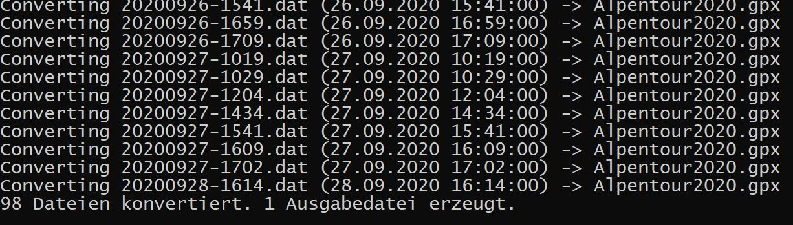
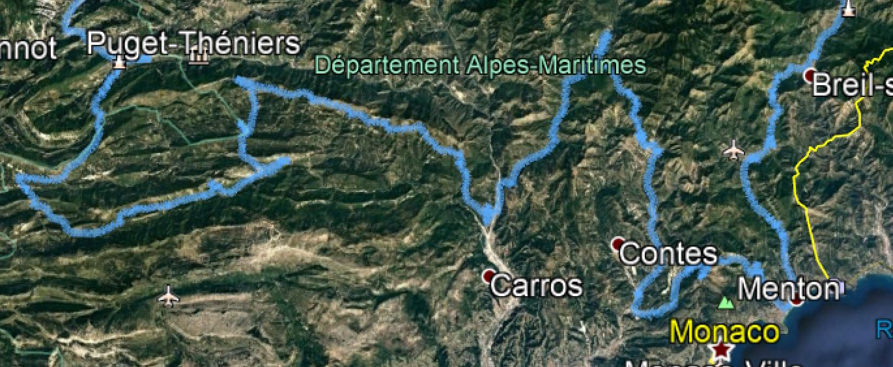

# wifiOiler GPX Converter

Die Fahrstrecken werden vom Öler in einem eigenen Format aufgezeichnet.

Mit diesem Tool können die Track-Dateien in das GPX Format konvertiert werden. Dann lassen sie sich z.B. in Google Earth anzeigen. Um das Projekt zu kompilieren, bzw. zu erstellen, wird Visual Studio benötigt (z.B. das kostenfrei nutzbare Visual Studio Community). 

**Syntax:** `gpstrack.exe [Quelle [Ziel]] [/o(verwrite)] [/d(aily)] [/r(ename)]`

Dabei bedeuten:

**Quelle:** ein Verzeichnis oder Suchmuster für Dateien, wie z.B. "D:\Touren\August" oder "202108*.dat". Wird als Quelle ein Verzeichnis angegeben, wird versucht, alle Dateien in diesem Verzeichnis mit der Endung .dat zu konvertieren.

**Ziel:** ist das Ziel ein existierendes Verzeichnis, werden die erzeugten .gpx Dateien in dieses Verzeichnis geschrieben. Existiert das Ziel dagegen nicht, wird als Ziel eine Datei angenommen und die Quelldateien werden in dieser Zieldatei zusammengefasst.

**/o(verwrite):** wird diese Option angegeben, werden existierende Zieldateien ohne Nachfrage überschrieben. Die Option kann vollständig oder teilweise angegeben werden (also "/o" oder  "/overwrite" oder allen Zwischenformen).

**/d(aily):** wird diese Option angegeben, werden Dateien auf Tagesbasis zusammengefasst. Die Zieldateien haben als Namen das Tagesdatum in der Form JJJJMMTT.gpx. Diese Option hat keine Wirkung, wenn als Ziel eine Ausgabedatei angegeben wurde.

**/r(ename):** eigentlich nicht mehr relevant. In der Vergangenheit kam es schon mal vor, dass das Datum im Dateinamen vom ersten Datum in der Datei abwich. Diese Option hat das nachträglich korrigiert. War der Dateiname z.B: "000000-1435.dat", versucht das Programm, ein gültiges Datum in den GPS Daten in der Datei zu finden und den Dateinamen damit zu "reparieren".

### Beispiele

**`gpstrack`** alle Dateien im aktuellen Verzeichnis mit der Endung .dat werden konvertiert in Dateien mit der Endung .gpx.

**`gpstrack D:\temp /d`** alle Dateien im Verzeichnis D:\temp (mit Endung *.dat) werden auf Tagesbasis zusammengefasst und in das Verzeichnis D:\temp geschrieben (mit Endung .gpx)

**`gpstrack . Alpentour2020.gpx /o`** alle Dateien aus dem aktuellen Verzeichnis (s. den Punkt) werden in einer Zieldatei mit Namen "Alpentour2020.gpx" zusammengefasst. Falls die Datei schon existiert, wird sie überschrieben. Die Ausgabe dabei sieht etwa so aus (Ausschnitt):

Und das Ergebnis in Google Earth (beim Öffnen Dateityp .gpx wählen):

